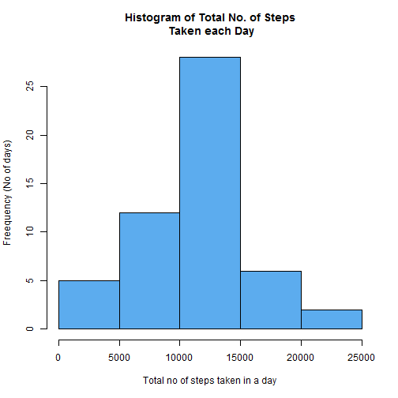
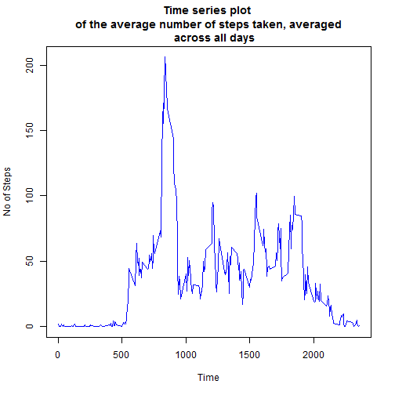
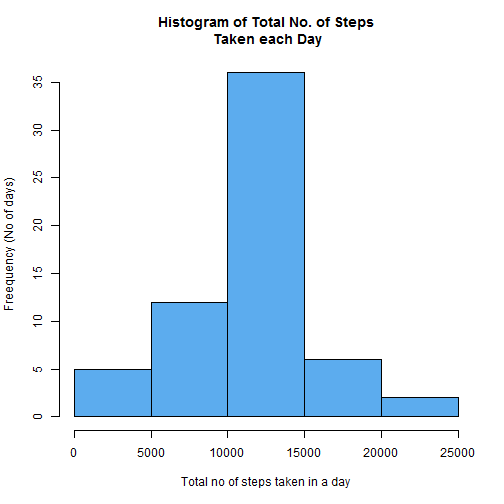
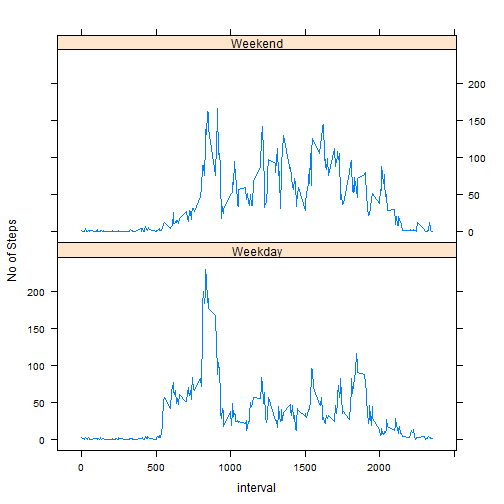

_This assignment makes use of data from a personal activity monitoring device. This device collects data at 5 minute intervals through out the day. The data consists of two months of data from an anonymous individual collected during the months of October and November, 2012 and include the number of steps taken in 5 minute intervals each day._
 
###Loading and preprocessing the data
Download and unzip the activity.zip file from this repository and keep activity.csv in your  working directory. Read the file into R using read.csv function

```r
steps_data <- read.csv("activity.csv")
```
Let's have a look at the data

```r
dim(steps_data) #Dimension of data set
```

```
[1] 17568     3
```

```r
head(steps_data) #First 6 rows of data frame
```

```
  steps       date interval
1    NA 2012-10-01        0
2    NA 2012-10-01        5
3    NA 2012-10-01       10
4    NA 2012-10-01       15
5    NA 2012-10-01       20
6    NA 2012-10-01       25
```

```r
tail(steps_data) #Last 6 rows of data frame
```

```
      steps       date interval
17563    NA 2012-11-30     2330
17564    NA 2012-11-30     2335
17565    NA 2012-11-30     2340
17566    NA 2012-11-30     2345
17567    NA 2012-11-30     2350
17568    NA 2012-11-30     2355
```
The file  contains data for 2 months of activity. 
  
###What is mean total number of steps taken per day?
_For this part of the assignment, you can ignore the missing values in the dataset._

_1. Calculate the total number of steps taken per day_

_2. If you do not understand the difference between a histogram and a barplot, research    the difference between them. Make a histogram of the total number of steps taken         each day_

The **aggregate** function will calculate **the total no of steps taken per day** and using **hist** function a histogram of the total no of steps taken each day can be made.

```r
aggr <- aggregate(steps~date, data =steps_data , sum)
hist(aggr$steps, col = "steelblue2", main= "Histogram of Total No. of Steps\n Taken each Day", 
     xlab = "Total no of steps taken in a day", ylab = "Freequency (No of days)")
```



_3. Calculate and report the mean and median of the total number of steps taken per day_

```r
mean_steps <- mean(aggr$steps)
median_steps <- median(aggr$steps)
```
**The mean and median steps of the total number of steps taken per day are 1.0766189 &times; 10<sup>4</sup> and 10765 rspectively**

###What is the average daily activity pattern?

1. Make a time series plot (i.e. type = "l") of the 5-minute interval (x-axis) and the average number of steps taken, averaged across all days (y-axis)

2. Which 5-minute interval, on average across all the days in the dataset, contains the maximum number of steps?


```r
aggr_mean <- aggregate(steps~interval, data = steps_data, mean)
plot(x= aggr_mean$interval, y = aggr_mean$steps, type = "l", col = "blue", 
     main = "Time series plot \nof the average number of steps taken, averaged
     across all days ", xlab = "Time", ylab = "No of Steps")
```


  
#### Interval Contains maximum steps

```r
aggr_mean[which.max(aggr_mean$steps),1]
```

```
[1] 835
```

```r
aggr_mean[which.max(aggr_mean$steps),2]
```

```
[1] 206.1698
```
  
  **The interval contains the maximum number of steps is 835 
  and the number of steps are 206.1698113**

### Imputing missing values
_Note that there are a number of days/intervals where there are missing values (coded as NA). The presence of missing days may introduce bias into some calculations or summaries of the data._

_1. Calculate and report the total number of missing values in the dataset (i.e. the total number of rows with NAs)_

_2. Devise a strategy for filling in all of the missing values in the dataset. The strategy does not need to be sophisticated. For example, you could use the mean/median for that day, or the mean for that 5-minute interval, etc._
  _Create a new dataset that is equal to the original dataset but with the missing data filled in._


```r
missing_total <- sum(is.na(steps_data$steps))
```
Total no of missing values in the data set are **2304**  

#### Strategy used for imputing NA values  

**The mean value of no. of steps for all the 5 minutes intervals are calculated using aggregate function(stored in aggr_mean variable).The NA values are then replaced by the mean value of steps for that 5-minute interval using a for loop**


```r
find_na <- is.na(steps_data$steps)
uniq <- unique(steps_data$interval)
j <- 1
for(i in uniq){
        steps_data$steps[find_na & steps_data$interval==i] <- aggr_mean[j,2]
        j <- j+1
}
```
3. Make a histogram of the total number of steps taken each day and Calculate and report the mean and median total number of steps taken per day. Do these values differ from the estimates from the first part of the assignment? What is the impact of imputing missing data on the estimates of the total daily number of steps?

```r
aggr <- aggregate(steps~date, data =steps_data , sum)
hist(aggr$steps, col = "steelblue2", main= "Histogram of Total No. of Steps\n Taken each Day", 
     xlab = "Total no of steps taken in a day", ylab = "Freequency (No of days)")
```



```r
mean_steps <- mean(aggr$steps)
mean_steps
```

```
## [1] 10766.19
```

```r
median_steps <- median(aggr$steps)
median_steps
```

```
## [1] 10766.19
```
**The mean and median steps of the total number of steps taken per day are 1.0766189 &times; 10<sup>4</sup> and 1.0766189 &times; 10<sup>4</sup> respectively**

###Are there differences in activity patterns between weekdays and weekends?
1. Create a new factor variable in the dataset with two levels - "weekday" and "weekend" indicating whether a given date is a weekday or weekend day.

First the class of the date variable is converted to "Date" using the as.Date function. Days are extracted using the "weekdays" function. Sundays are Saturdays are labelled as weekends and remaining days as weekdays.


```r
steps_data$date <-  as.Date(steps_data$date, origin = "%y-%m-%d")
steps_data$week <-  weekdays(steps_data$date)
steps_data$day <- "Weekday"
steps_data$day[steps_data$week=="Sunday"|steps_data$week=="Saturday"] <- "Weekend"
```
Using data.table library average of weekends are weekdays are calculated.

```r
library(data.table)
steps_data <-  as.data.table(steps_data)
new_avg <- steps_data[,mean(steps),by = c("interval","day")]
```
2. Make a panel plot containing a time series plot (i.e. type = "l") of the 5-minute interval (x-axis) and the average number of steps taken, averaged across all weekday days or weekend days (y-axis).

Panel plot is made using the xyplot function from lattice 

```r
library(lattice)
xyplot(V1~interval|day,data=new_avg,type="l",layout=c(1,2),ylab = "No of Steps")
```




